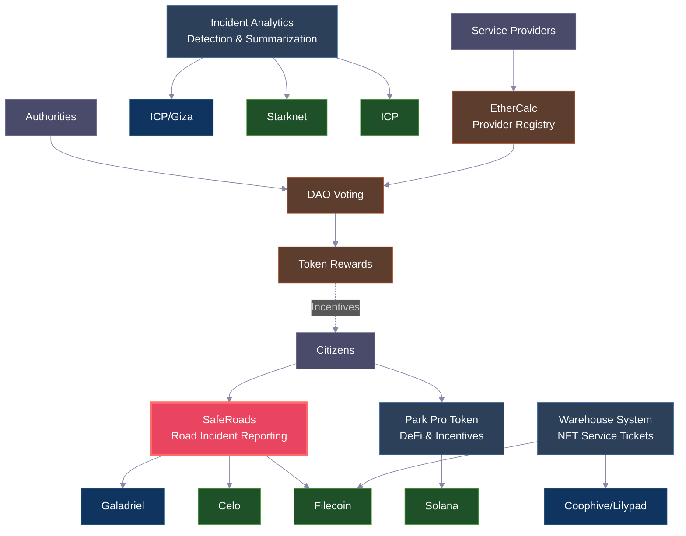

# Transport DAO

Transport DAO is a decentralized application platform that leverages Web3 tools and AI to provide a secure, transparent, and tamper-proof transportation management system. By utilizing smart contracts, Transport DAO enables the automated execution of transportation agreements, ensuring that all parties involved adhere to the agreed terms without the need for intermediaries. The platform offers features such as real-time tracking of shipments, automated payments upon delivery, and dispute resolution mechanisms, all powered by blockchain technology. This ensures trust, reduces administrative overhead, and enhances the overall efficiency of the transportation process.

## Table of Contents

- [Overview](#overview)
- [Ecosystem Architecture](#ecosystem-architecture)
- [Technology Stack](#technology-stack)
- [Platform Components](#platform-components)
  - [1. Solana Integration - Park Pro Token](#1-solana-integration---park-pro-token)
  - [2. Filecoin Virtual Machine (FVM) - Privacy & AI](#2-filecoin-virtual-machine-fvm---privacy--ai)
  - [3. Galadriel AI Agents](#3-galadriel-ai-agents)
  - [4. Coophive & Lilypad - Trusted AI Development](#4-coophive--lilypad---trusted-ai-development)
  - [5. Internet Computer Protocol (ICP) - Decentralized AI](#5-internet-computer-protocol-icp---decentralized-ai)
  - [6. Starknet & Nethermind - zkEVM Solutions](#6-starknet--nethermind---zkevm-solutions)
  - [7. SafeRoads - Civic Reporting & Road Safety](#7-saferoads---civic-reporting--road-safety)
- [Service Provider Network](#service-provider-network)
- [Demos & Live Applications](#demos--live-applications)
- [Architecture & Workflow](#architecture--workflow)
- [Getting Started](#getting-started)

---

## Overview

Transport DAO combines cutting-edge Web3 technologies with AI to create a comprehensive transportation and logistics management ecosystem. Our platform integrates multiple blockchain networks, AI agents, and decentralized storage solutions to provide secure, transparent, and automated transportation services.

## Ecosystem Architecture

## Technology Stack

### Blockchain Networks
- **Solana** - High-performance blockchain for Park Pro Token
- **Ethereum** - Smart contracts and DeFi integration
- **Filecoin** - Decentralized storage and FVM smart contracts
- **Internet Computer (ICP)** - Scalable Web3 infrastructure
- **Starknet** - Zero-knowledge rollup solutions

### AI & Privacy Tools
- **Galadriel** - On-chain AI agent development
- **Coophive & Lilypad** - Distributed AI computation
- **Bacalhau** - AI model deployment and execution

### Development Frameworks
- **Neon Transfer SDK** - Cross-chain interoperability
- **OpenZeppelin** - Secure smart contract libraries
- **Giza** - AI inference on Starknet

---

## Platform Components

### 1. Solana Integration - Park Pro Token

**NeonVM Utility Token Implementation**

We are developing a NeonVM utility token (Park Pro Token) using Neon transfer SDK, OpenZeppelin and enabling Smart incentivization using both Solana and Ethereum, Gnosis Pay with QR code dapp, EtherCalc.

#### Key Features:
- Effortless DeFi and NFT integration for a decentralized financial future
- Securely send and redeem Solana and Ethereum tokens with an expiry for redemption
- Purchase Ethereum based tokens using credit and debit cards, as well as various crypto assets for South Asian countries where the majority of tokens cannot be withdrawn from exchanges to wallets
- Seamless management of fiat and crypto payment options across desktop and mobile platforms
- User-friendly interface for convenient navigation and control over your digital assets

#### Live Applications:
- **Lottery Incentivization dApp**: [solana-lottery-dapp-rouge.vercel.app](https://solana-lottery-dapp-rouge.vercel.app/)
- **Demo Videos**: [Google Drive](https://drive.google.com/drive/u/1/folders/1twBmTFMY4N-ccA_n44dhWI5XfiE7igFU)

We are integrating the Park Pro Token with EtherCalc where we are maintaining a list of vehicle service providers.

### 2. Filecoin Virtual Machine (FVM) - Privacy & AI

**Incident Archiving & Warehouse Management Solutions**

FVM enables us to use building blocks exposed through interfaces, enabling the construction of incident archiving solutions. This improves better outcomes for monitoring, incident reporting, and precision maintenance at the warehouse.

#### Core Implementations:

**Warehouse Service Ticket NFT System:**
- Creating a Warehouse Service Ticket NFT on the FVM for NFC tags of service and repair providers
- Improving incident management through decentralized NFT-based voting system
- Votes are uploaded to IPFS with the most recent vote linking to one before

**Decentralized DAO Voting System:**
- NFT-based voting system for contract work for warehouse service & maintenance providers
- DAOs can issue NFTs to wallets based on service and maintenance performance
- NFT holders can create proposals and vote on other proposals

#### Automated Workflow Process:
1. Warehouse DAOs create a RFP for providing service or maintenance using work orders on the dapp
2. Warehouse service providers join a RFP by minting an NFT of that RFP (created on FVM)
3. Warehouse service providers with RFP NFTs are eligible to create proposals and vote
4. Voting is gasless and stored on IPFS and Filecoin with verifiable data chain
5. Previous vote's CID is stored in the newest vote file, creating a chain of verifiable data

#### Resources:
- **Screenshots**: [Google Drive](https://drive.google.com/drive/u/1/folders/1NFSDYcx8rxheCX5SmVCHCyRNFhhhF03I)
- **Demo Video**: [Google Drive - demo-video.mp4](https://drive.google.com/drive/u/1/folders/1NFSDYcx8rxheCX5SmVCHCyRNFhhhF03I)
- **DataDAO Contract Deployment**: Available on Filfox explorer

### 3. Galadriel AI Agents

**On-Chain AI for Incident Management & Supply Chain**

We are using Galadriel to develop an AI agent for incident summarization during supply chain management and logistics services and for managing fraud detection and insurance inventory management at the location. This enables incident management and early stage detection of goods and equipment insurance issues in case of an incident.

#### Core Objectives:
- Decentralized platform for logistics incident reporting and summarization by employees and contractors
- Community-driven approach to improving warehouse safety
- Integration of advanced technologies for incident summarization, detection and prevention
- Smart incentivization using QR code dapp, EtherCalc

#### Social Integration:
**Farcaster Frame Integration:**
- [Frame 1](https://warpcast.com/~/developers/frames?url=https%3A%2F%2Fframes.neynar.com%2Ff%2F1369eae6%2F69ae0817)
- [Frame 2](https://warpcast.com/~/developers/frames?url=https%3A%2F%2Fframes.neynar.com%2Ff%2F1369eae6%2F69ae0817)

#### Resources:
- **Demos**: [Google Drive](https://drive.google.com/drive/u/1/folders/1X3lQ12CRuyswVenF53UZakYcl86UbxQk)

### 4. Coophive & Lilypad - Trusted AI Development

**Distributed AI Computation for Warehouse Management**

We are developing a Warehouse Equipment NFT and a Service/Repair Work Order NFT for preventive maintenance at the warehouse on the Filecoin Virtual Machine (FVM / FEVM) using Coophive, Lilypad with Bacalhau Stable Diffusion.

#### Integration Features:
- Warehouse service and work order flows development
- Preventive maintenance via integration with alarm clock dapp
- Logistics scheduler for heavy goods using inter-state trains
- AI agent for incident summarization during supply chain management
- Fraud detection and insurance inventory management at warehouse locations
- Early stage detection of goods and equipment insurance issues

#### #buildwithbacalhau Integration:
We are extending the #buildwithbacalhau resources to create an NFT for the Warehouse Equipment CAD file on the Filecoin Virtual Machine (FVM / FEVM) with Bacalhau Stable Diffusion. This enables us to:
- Share and delegate a Work Order NFT on the FVM
- Enable decentralized NFT-based voting system for contract work by warehouse service providers
- Upload votes to IPFS/FVM with the most recent vote linking to one before

#### Resources:
- **Screenshots and Demos**: [Google Drive](https://drive.google.com/drive/u/1/folders/1NFSDYcx8rxheCX5SmVCHCyRNFhhhF03I)
- **NFT Usage in Logistics**: [Google Drive](https://drive.google.com/drive/u/1/folders/17RW3_ANbgHPHx2i7PHXPM65Tv-MuVaHa)

### 5. Internet Computer Protocol (ICP) - Decentralized AI

**Investigative Case Management & Object Detection System**

Investigative case management solution for citizens, police officers, drivers to report and manage incidents, detect and prevent accidents on web using Internet Computer Blockchain and developer tooling for data analytics, organization and visualization, ZKP and scrypt aided Transport Bitcoin wallet, gateway RPC end points for interoperability.

#### AI Object Detection System:
An AI-based object detection system that utilizes ICP developer tooling for data analytics, decentralized storage for sorting information obtained from cameras. With just a cell phone, users are offered an ICP solution that can detect objects in real time with more object types for better accuracy.

#### Live Deployments:
- **Incident Summarization Canister (PoC)**: [24ten-naaaa-aaaag-ald6q-cai.icp0.io](https://24ten-naaaa-aaaag-ald6q-cai.icp0.io/)

#### Local Development:
- Local canister deployments:
  - [Local Canister 1](http://127.0.0.1:4943/?canisterId=bd3sg-teaaa-aaaaa-qaaba-cai)
  - [Local Canister 2](http://bd3sg-teaaa-aaaaa-qaaba-cai.localhost:4943/)

#### Bootable OS Integration:
**IC Canister for Command and Control Centers:** This enables an OS where secure and transparent workflows for Quotation, Bidding and Invoicing, voting and token management for contract work undertaken by contractors and road developers from Ministry of Road and Transportation, administrators can be undertaken on ICP blockchain Network.

#### Resources:
- **Demo Videos**: [Google Drive](https://drive.google.com/drive/u/1/folders/1Wi1SwqzG7P5CEpXSdr-5Zu6JwrBUUepV)

### 6. Starknet & Nethermind - zkEVM Solutions

**AI-Powered Object Detection & Vehicle Service NFTs**

We are developing a Starknet based dapp solution, which offers an Artificial Intelligence-based object detection system that utilizes Giza for sorting information obtained from key locations, cameras deployed at monitoring spots.

#### Vehicle Repair and Service NFTs Features:
- Enable hyperlocal service and repair delivery information
- Enable QR code based blockchain payments at key sites with support for key Ethereum based blockchain platforms
- Enhance safety through smart incentivization of incident reporting by employees and logistics providers

#### Live Applications:
- **Incident Summarization dApp**: [web3-road-incident.vercel.app](https://web3-road-incident.vercel.app/)

#### Contract Deployments:
- Deployment of zk Work Order Listing Verifier contracts using Starknet Sepolia
- View contracts at StarkScan (screenshots available in resources)

#### Resources:
- **Screenshots**: [Google Drive](https://drive.google.com/drive/u/1/folders/1tbjSHzfWMj5iYqp6wu8931jKhY0oq2nX)
- **Demo Videos**: [Google Drive](https://drive.google.com/drive/u/1/folders/1tbjSHzfWMj5iYqp6wu8931jKhY0oq2nX)
  - Demo- mobile device_ios_screen capture.mov
  - AI-Object-Detection-Logistics-Starknet-Screencast-Demo.mov

### 7. SafeRoads - Civic Reporting & Road Safety

**Multi-Chain Road Incident Management Platform**

SafeRoads is a comprehensive road safety and incident management module that incentivizes citizens to report road incidents while ensuring transparency and accountability through blockchain technology.

#### Key Features:
- **Token Rewards** - Citizens earn cryptocurrency rewards (CELO/FIL) for verified incident reports
- **Incidents Dashboard** - Real-time verification portal for authorities to review and approve reports  
- **Aadhaar-enabled ZK Verification** - Zero-knowledge identity verification using Self Protocol (Celo)
- **Multi-Platform Access** - Web dApp, Telegram Mini App, and mobile-friendly interfaces
- **Decentralized Storage** - IPFS integration for permanent, tamper-proof evidence storage
- **AI-Powered Verification** - Noah AI integration for streamlined authority workflows

#### Multi-Chain Implementations:

**SafeRoads Celo:**
- **Live App**: [self-road-report-celo.vercel.app](https://self-road-report-celo.vercel.app/)
- **Features**: Aadhaar-based identity verification with Self Protocol, Telegram Mini App integration
- **Smart Contracts**: ProofOfHuman Contract, IncidentContract on Celo Sepolia

**SafeRoads Filecoin:**
- **Live App**: [saferoads-filecoin.vercel.app](https://saferoads-filecoin.vercel.app/)
- **Features**: Enhanced decentralized storage with Storacha, professional PDF generation with IPFS
- **Smart Contracts**: IncidentManager contract on Filecoin Calibration testnet

#### Resources:
- **Celo Implementation**: [saferoads-celo/](saferoads-celo/)
- **Filecoin Implementation**: [saferoads-filecoin/](saferoads-filecoin/)
- **Telegram Bot**: [@saferoads_dao_bot](https://t.me/saferoads_dao_bot)
- **Demo Videos**: [Google Drive](https://drive.google.com/drive/folders/1dCfET3D1Tt42aQ7yfovlCXsd5ued5IUk?usp=drive_link)

---

## Service Provider Network

### Vehicle Service Provider Registry
**EtherCalc Integration**: We maintain a comprehensive list of vehicle service providers through EtherCalc integration across all platform components.

**Access Link**: [ethercalc.net/veg1fcob7fe3](https://ethercalc.net/veg1fcob7fe3)

This registry is integrated across:
- Solana Park Pro Token ecosystem
- Filecoin FVM voting systems  
- Galadriel AI agent workflows
- Coophive/Lilypad preventive maintenance
- Starknet service NFT systems

---

## Demos & Live Applications

### Active Deployments
- **Solana Lottery dApp**: [solana-lottery-dapp-rouge.vercel.app](https://solana-lottery-dapp-rouge.vercel.app/)
- **SafeRoads Celo**: [self-road-report-celo.vercel.app](https://self-road-report-celo.vercel.app/)
- **SafeRoads Filecoin**: [saferoads-filecoin.vercel.app](https://saferoads-filecoin.vercel.app/)
- **Starknet Incident Reporter**: [web3-road-incident.vercel.app](https://web3-road-incident.vercel.app/)
- **ICP Incident Canister**: [24ten-naaaa-aaaag-ald6q-cai.icp0.io](https://24ten-naaaa-aaaag-ald6q-cai.icp0.io/)

### Demo Collections
- **Solana Integration**: [Google Drive](https://drive.google.com/drive/u/1/folders/1twBmTFMY4N-ccA_n44dhWI5XfiE7igFU)
- **SafeRoads**: [Google Drive](https://drive.google.com/drive/folders/1dCfET3D1Tt42aQ7yfovlCXsd5ued5IUk?usp=drive_link)
- **Filecoin FVM**: [Google Drive](https://drive.google.com/drive/u/1/folders/1NFSDYcx8rxheCX5SmVCHCyRNFhhhF03I)
- **Galadriel AI**: [Google Drive](https://drive.google.com/drive/u/1/folders/1X3lQ12CRuyswVenF53UZakYcl86UbxQk)
- **ICP Solutions**: [Google Drive](https://drive.google.com/drive/u/1/folders/1Wi1SwqzG7P5CEpXSdr-5Zu6JwrBUUepV)
- **Starknet dApps**: [Google Drive](https://drive.google.com/drive/u/1/folders/1tbjSHzfWMj5iYqp6wu8931jKhY0oq2nX)
- **Coophive Integration**: [Google Drive](https://drive.google.com/drive/u/1/folders/17RW3_ANbgHPHx2i7PHXPM65Tv-MuVaHa)

---

## Architecture & Workflow

### Cross-Chain Integration
Transport DAO leverages multiple blockchain networks to provide comprehensive coverage:

1. **Solana**: High-throughput transactions and Park Pro Token operations
2. **Ethereum**: DeFi integration and established ecosystem compatibility
3. **Filecoin**: Decentralized storage with smart contract capabilities via FVM
4. **ICP**: Scalable Web3 infrastructure for AI and data analytics
5. **Starknet**: Zero-knowledge proofs for privacy-preserving operations

### AI Integration Pipeline
1. **Data Collection**: IoT sensors, cameras, and manual reporting
2. **Processing**: Galadriel on-chain AI, Coophive/Lilypad distributed computation
3. **Analysis**: Incident summarization, fraud detection, predictive maintenance
4. **Action**: Automated work orders, payments, and notifications
5. **Verification**: Blockchain-based audit trails and voting mechanisms

### Service Provider Ecosystem
- **Registration**: EtherCalc-based provider network
- **Verification**: NFT-based qualification system
- **Work Orders**: Smart contract automated assignments
- **Payment**: Cross-chain token settlements
- **Quality Control**: DAO-based voting and reputation system

---

## Getting Started

### Prerequisites
- Web3 wallet (MetaMask, Argent, etc.)
- Basic understanding of blockchain interactions
- Internet connection for accessing dApps

### Quick Start
1. **Visit our live applications** using the links in the [Demos section](#-demos--live-applications)
2. **Connect your wallet** to interact with the respective platforms
3. **Explore features** specific to each blockchain network
4. **Join our service provider network** through the EtherCalc registry
5. **Participate in governance** through our DAO voting mechanisms

### Development Setup
For developers looking to contribute or integrate:
1. Clone the repository components for your target blockchain
2. Follow the deployment guides in each network's folder
3. Reference our demo videos for integration patterns
4. Join our community channels for technical support

---

*Transport DAO - Revolutionizing logistics through decentralized technology and AI innovation.*

  

